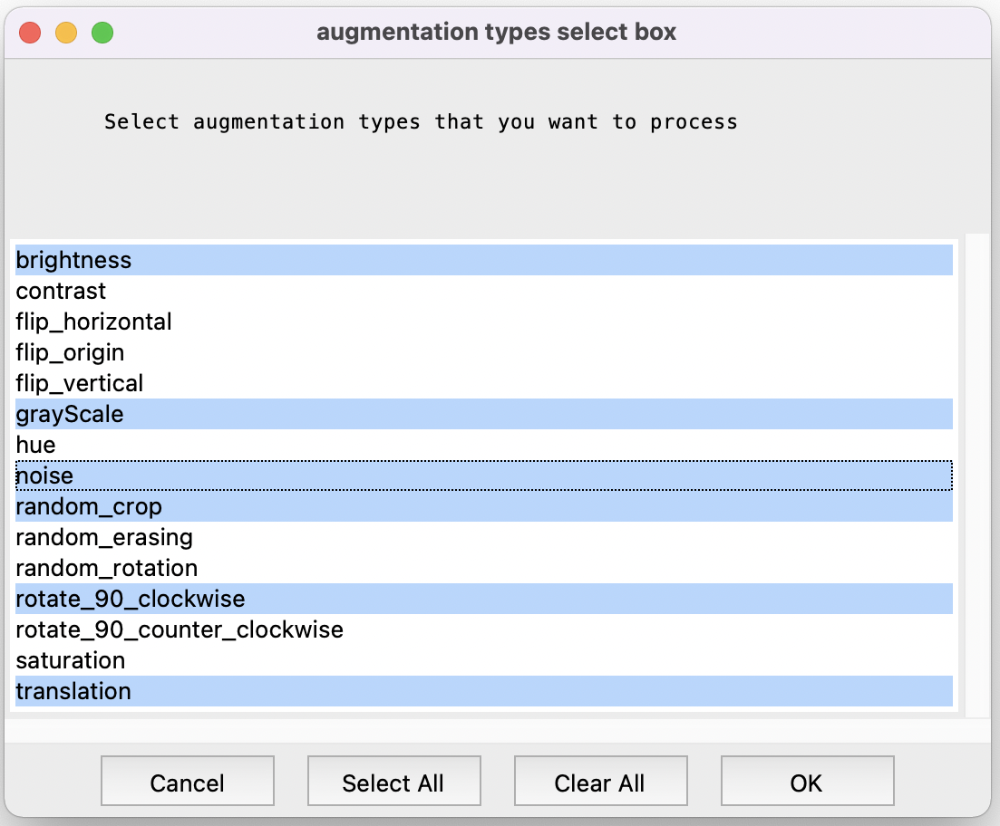

# DataAugmentation
This is a data augmentation tool for creating augmented data from a bunch of images under directory with GUI.

## Usage
1- First select the directory.

2- Then program will detect the extansions under that directory. Select the target extansion. Doesn't matter jpeg, png, tif etc..

3- Select augmentation types you want

4- Your new augmented images will be under the selected directory.

5- To reuse the tool you must delete old created files with their directory.

